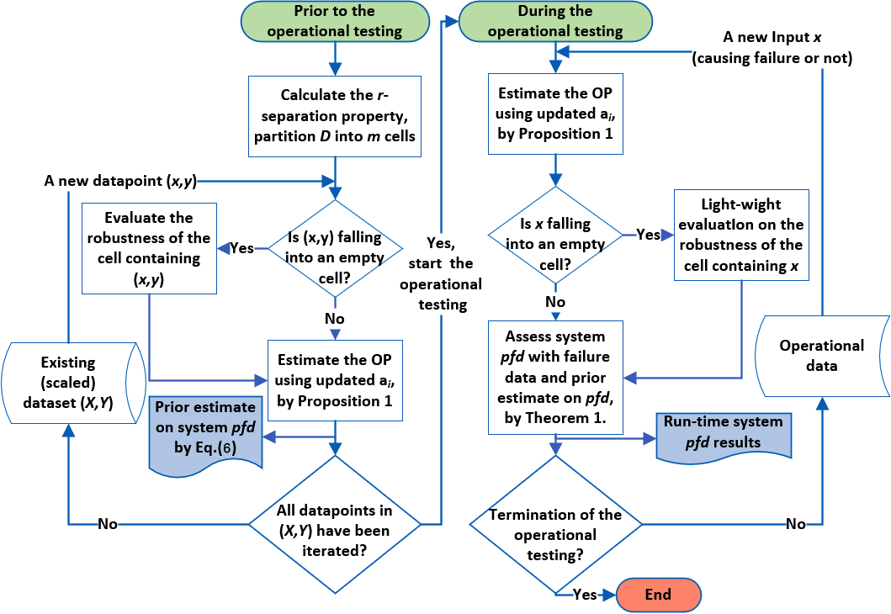

# ReAsDL
The Reliability Assessment Model (RAM) for Deep Learning (DL) Systems

(Published version to appear, cf. authors' [preprint](https://x-y-zhao.github.io/files/TechRept_ReAsDL.pdf) for now.)

## Overview of ReAsDL

<p align="center">
  
  <br />
  The Workflow of RAM for DL Systems (cf. the original paper for detailed descriptions).
  <br />
</p>


The proposed RAM is inspired by partition-based testing and operational testing with uncertain operational profiles (OP), corresponding to two major stages: (a) Prior to operational testing, the input space was partitioned into three types of cells. The robustness (to the ground truth label) of cells are evaluated, then “assembled” according to their estimated OPs to form prior knowledge on the system reliability; (b) During operational testing we update the OP of cells as well as the system reliability given newly collected operational data. Subject to certain conditions being met, a light-weight robustness verifier will be invoked for certain cells whose results will be incorporated into the RAM.

## Case Studies of ReAsDL

We conduct case studies to demonstrate our RAM with 3 DNNs trained on the common MNIST, CIFAR-10 and also a real-word traffic sign recognition benchmarks (GTSRB). Prior to operational testing, we evaluate the label separation distance and decide the cell size based on this. The primary reliability assessment results can be found in the the original paper. For each DNN, we synthesise three operational test sets, OP1, OP2, and OP3 to simulate the operational testing.

<p align="center">
  
  <br />
  Case studies on three DNNs with three types of operational test sets.
  <br />
</p>

OP1 represents the early (or ``burn-in'') stage of the operational testing. Inputs mostly fall into empty cells due to the sparsity of the existing data, thus the estimates on the OP are far from stable. OP2 consists of data randomly sampled from both the training and test datasets with perturbation, thus it represents an ideal case where the existing dataset statistically depicts the future operational use. While, OP3 represents the case where the future OP and the existing dataset used for training are mismatched, which is common and not necessarily bad (cf. the orginial paper for more discussions).

## Repository Structure

ReAsDL provides the training and operational testing of MNIST, CIFAR-10 and GTSRB models. To be specific:

* **train** contains all the source codes to train the MNIST, CIFAR-10 and GTSRB models;
* **data** contains all the necessary datasets for the training and evaluation along with the trained model files;
* **plnn** associates to the statistical evaluation of DL model's robustness through multi-level splitting methods;
* **mnist.py, cifar10.py and gtsrb.py** are the class objects to load the operational test sets.


### Pacakage Dependencies 

The running environment is tested in python 3.8, some necessary pacakages include:

```
scikit-learn, pytorch, numpy, matplotlib, seaborn, joblib, and Gurobi
```

### Command to Run

To run the prior assessment of cifar-10 model, type the commad:
```
python main('cifar10', 'before', cell_size = 20, count_mh_steps = 100, count_particles = 500)
```

## Acknowledgement 

We acknowledge the paper "A Statistical Approach to Assessing Neural Network Robustness" (https://github.com/oval-group/statistical-robustness) to provide an elegant way for assessing the local robustness in each cell, and "A Closer Look at Accuracy vs. Robustness" (https://github.com/yangarbiter/robust-local-lipschitz) to provide us with a rule of thumb on determining the cell size.
